# time.md for Obsidian

time.md navigates and visualizes data exported from the [time.md](https://timemd.app) screen-time analytics app, directly inside Obsidian.

Drop any time.md export into a folder in your vault and time.md recreates the core time.md experience — Overview, Trends, Calendar, Details, and Apps & Categories views — without needing to open the app.

## Supported import formats

time.md auto-detects and parses every format time.md can export:

- **JSON** (`.json`) — nested or flat
- **CSV** (`.csv`) — with or without metadata comments and section markers
- **Markdown** (`.md`) — GitHub-flavored tables with metadata header
- **Obsidian** (`.md`) — YAML frontmatter + wiki links, fully navigable in place

## Views

| View | What it shows |
|------|---------------|
| Overview | Total, daily average, peak hour, longest session, trend, distribution donut, top apps, heatmap, and web-history overview |
| Trends | Range-aware daily/hourly defaults, stacked by-app chart (with Raw Sessions), hourly usage chart, app rhythm, focus-vs-fragmentation scatter, category balance, day archetypes, top apps by day, and daily breakdown |
| Calendar | Stats strip, GitHub-style daily contribution heatmap, 7×24 usage heatmap, date × hour heatmap (with Raw Sessions), intensity legend, and month grid |
| Details | Session stats, duration distribution, daily timeline, app lanes, session waterfall, context-switch intensity, attention-flow Sankey, and filterable raw-session table |
| Apps & Categories | Aggregated apps and categories with percentages |
| Projects | Category groups with donut distribution chart and stats |
| Web History | Browser history timeline, top domains, hourly activity |
| Reports | Daily / weekday breakdowns, period comparison, distribution charts, and CSV / JSON / Markdown export |
| Input Tracking | Cursor heatmap, typing intensity, top words / keys, per-app clicks (opt-in in time.md) |

Open any view from the command palette (`time.md: Open Overview`, etc.) or the ribbon icon.

## Visualization gallery

The screenshots below are rendered from the plugin's live embed renderer against representative sample data. Every `view:` value can be used in a `timemd` code block.

### Core screen-time visualizations

| Visualization | Embed view | What it shows | Screenshot |
|---|---|---|---|
| Overview dashboard | `overview` | Stats, trend, weekly heatmap, and top apps in one dashboard. | 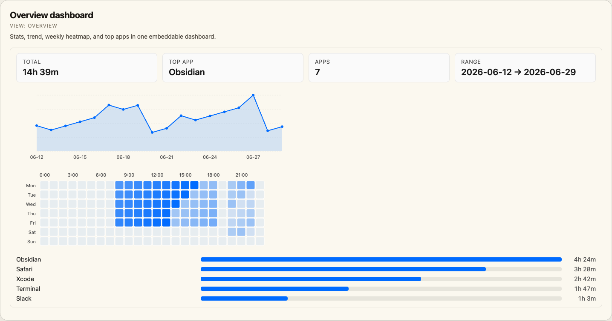 |
| Stat card | `stat` | One focused metric such as total time, top app, app count, days, or peak day. | 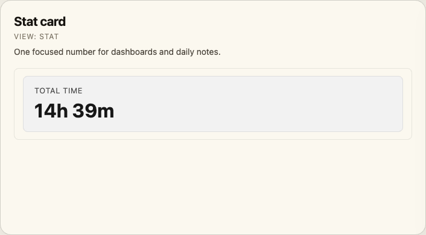 |
| Trend chart | `trend-chart` / `trends` | Daily active time line chart. | 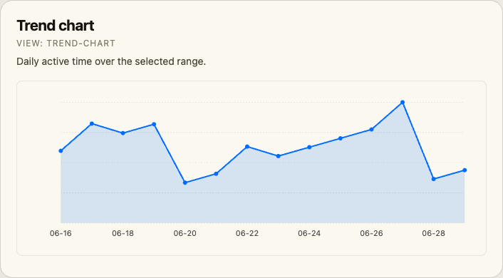 |
| Weekly heatmap | `heatmap` / `calendar` | Weekday × hour activity intensity. | 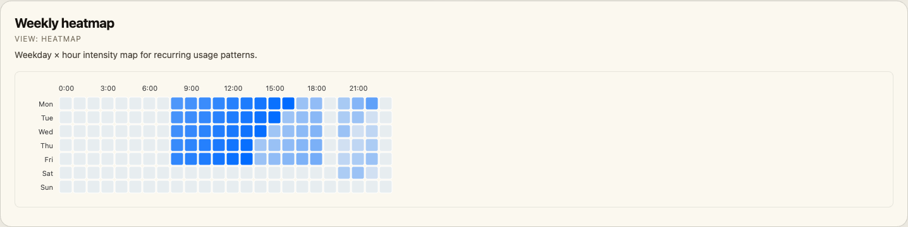 |
| Top apps | `top-apps` / `apps` | Ranked app totals with proportional bars. | 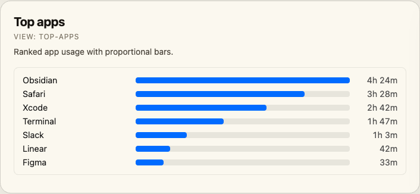 |
| Categories | `categories` | Category totals and share of tracked time. | 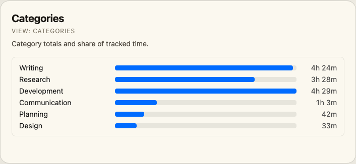 |
| Recent sessions | `details` | Latest raw sessions with app, timestamp, and duration. | 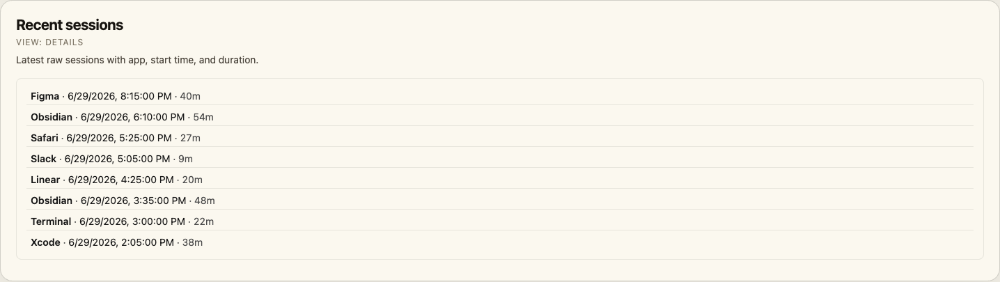 |

### Attention, rhythm, and session analysis

| Visualization | Embed view | What it shows | Screenshot |
|---|---|---|---|
| Attention flow | `transition-sankey` | Sankey diagram showing where focus moves between apps. | 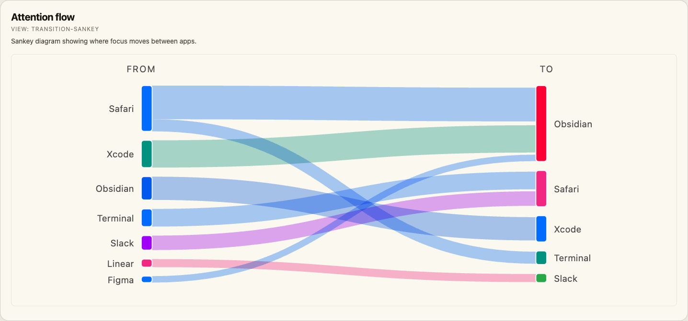 |
| App lanes | `app-lanes` | Per-app timeline lanes for the latest day. | 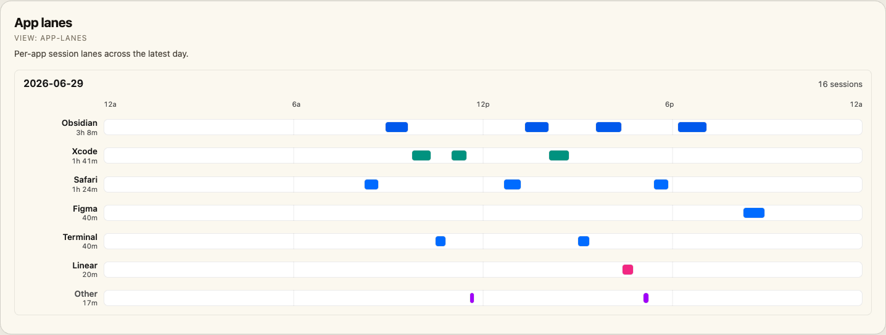 |
| Session waterfall | `session-waterfall` | Chronological sessions with duration bars. | 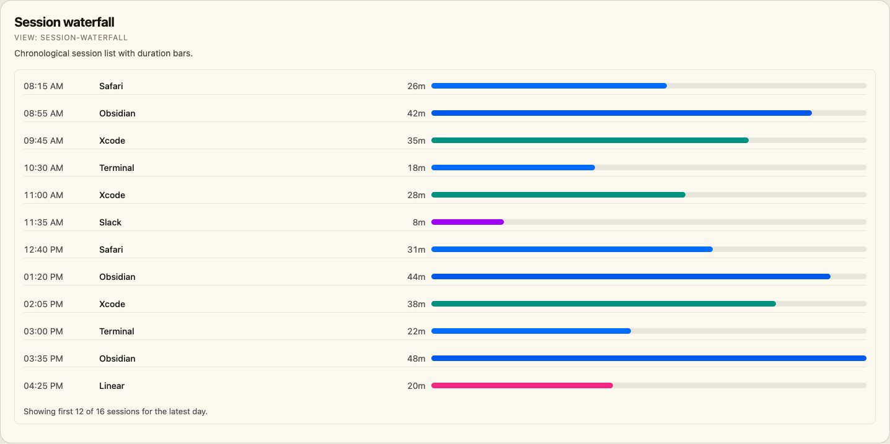 |
| App rhythm | `app-rhythm` | App × hour heatmap for daily usage rhythms. | 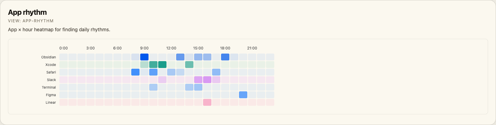 |
| Focus vs fragmentation | `fragmentation-scatter` | Daily active time versus switches per hour; bubble size is session count. | 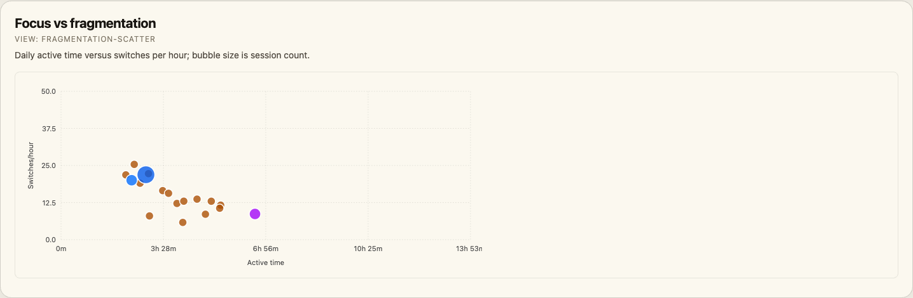 |
| Category balance | `category-balance` | Category mix from daily and hourly matrices. | 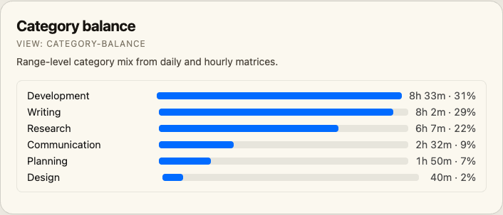 |
| Day archetypes | `day-archetypes` | Day classifications such as deep work, fragmented, or browsing-heavy. | 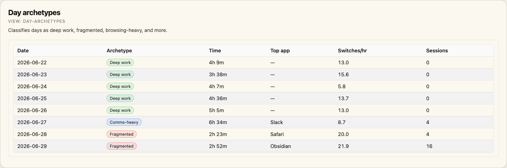 |
| Contribution heatmap | `contribution-heatmap` | Calendar-style daily activity heatmap. | 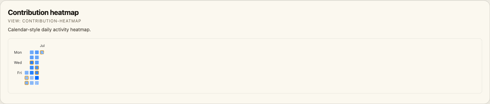 |
| Date × hour heatmap | `date-hour-heatmap` | Raw-session-derived grid by date and hour. | 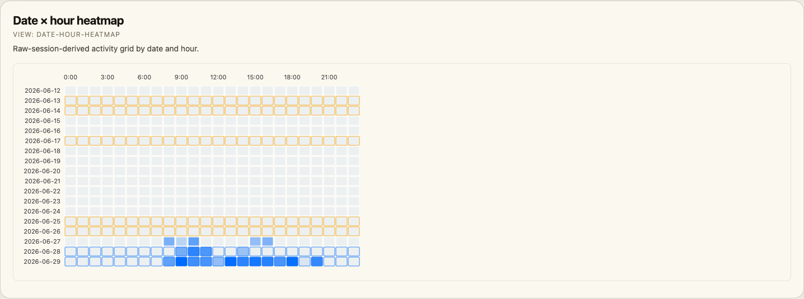 |

### Projects, reports, and browsing

| Visualization | Embed view | What it shows | Screenshot |
|---|---|---|---|
| Projects | `projects` | Category/project list paired with distribution stats. | 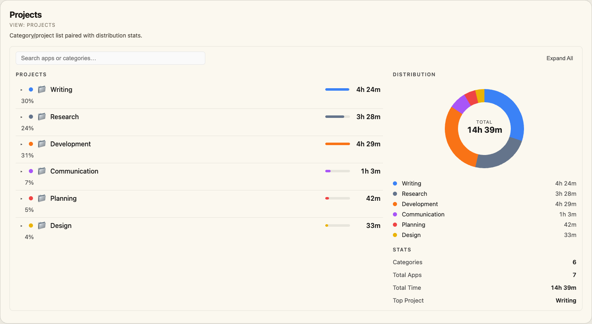 |
| Distribution donut | `distribution` | Category share as a donut with legend and stats. | 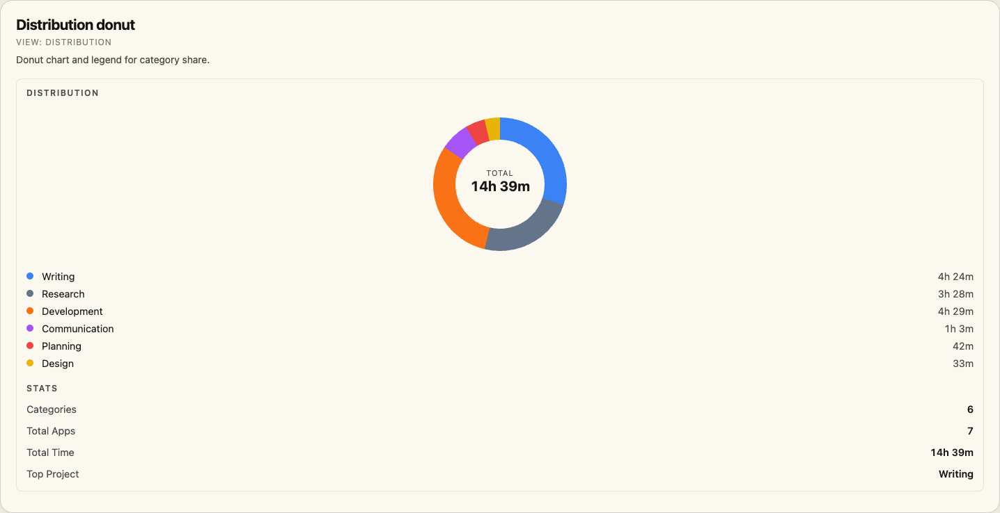 |
| Web history | `web-history` | Browser history stats, timeline, domains, or hourly activity. | 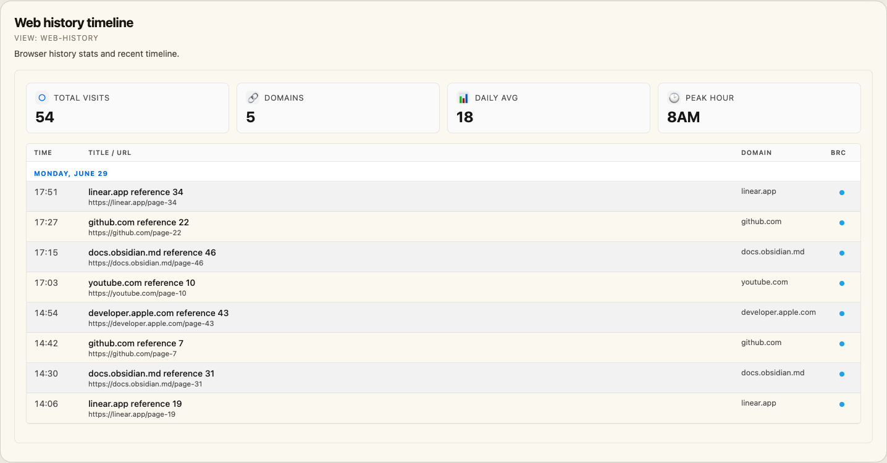 |
| Reports | `reports` | Summary stats, period comparison, distributions, weekday averages, and export table. | 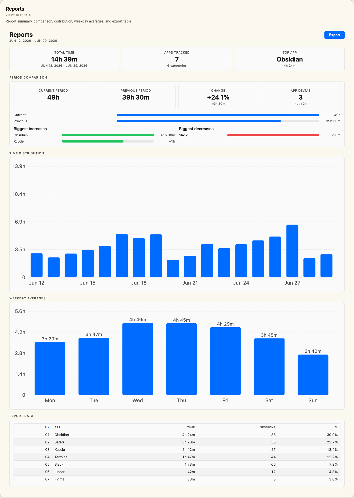 |

### Input tracking visualizations

| Visualization | Embed view | What it shows | Screenshot |
|---|---|---|---|
| Input stats | `input-stats` | Keystrokes, peak typing minute, cursor samples, clicks, and observed apps. | 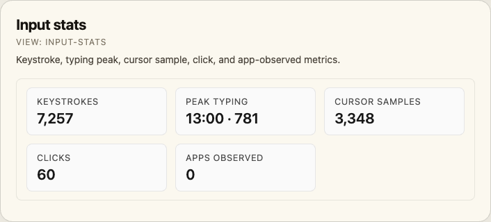 |
| Cursor heatmap | `cursor-heatmap` | Absolute screen-coordinate cursor heatmap with click overlay. | 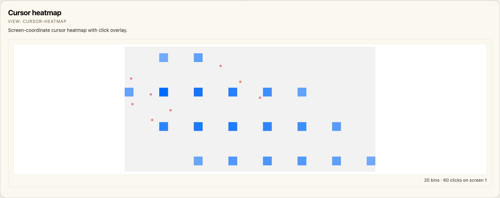 |
| Typing intensity | `typing-intensity` | Hourly keystroke line chart. | 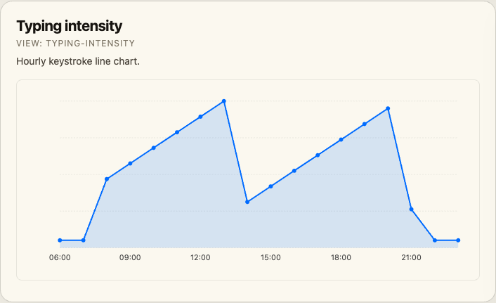 |
| Top typed keys | `top-keys` | Most-pressed keys. | 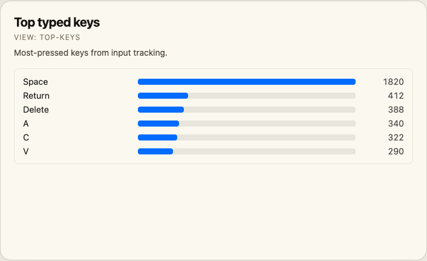 |
| Top typed words | `top-words` | Most-typed words with default redaction controls. | 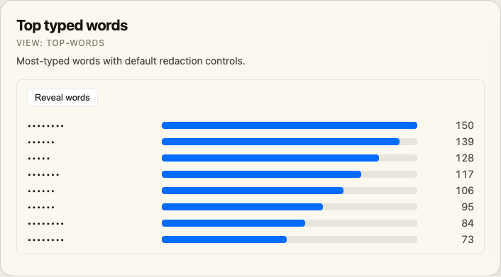 |
| Input activity | `input-activity` | Per-app click counts from raw mouse events. | 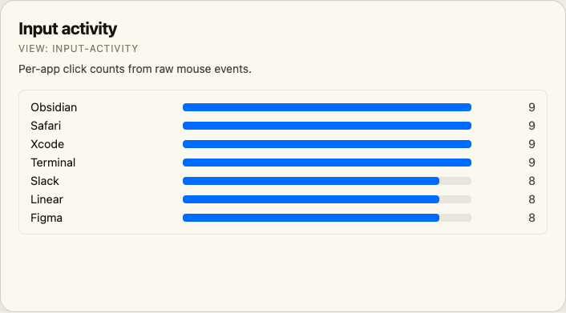 |


## Input Tracking

If you've enabled **Input Tracking** in the time.md app (Settings → Input Tracking), the `.input` destination emits six new sections that this plugin renders as the **Input Tracking** view:

| Section | What it shows |
|---------|---------------|
| Cursor Heatmap Bins | 2D heat overlay in absolute screen coordinates, per-screen tab strip, optional click overlay |
| Typing Intensity | Hourly keystrokes line chart |
| Top Typed Keys | Bar list of the 25 most-pressed keys |
| Top Typed Words | Bar list of the 50 most-typed words (only populated when "Full content" capture is on; default-redacted with a Reveal toggle) |
| Raw Mouse Events | Per-app click counts + click dots overlaid on the cursor heatmap |
| Raw Keystrokes | Optional first-200 timeline (chars default-redacted; secure-input rows show 🔒) |

### Example export workflow

1. In time.md → **Export** view, pick **Destination = Input** (or **Combined** with the input toggles enabled).
2. Pick a format the plugin can read — JSON is recommended for the raw sections:

   ```
   Format:      JSON
   Destination: Input
   Date range:  Today
   Sections:    Top Typed Words, Top Typed Keys,
                Cursor Heatmap Bins, Typing Intensity,
                Raw Keystrokes (optional),
                Raw Mouse Events (optional)
   ```

3. Save the file into the folder you've configured under **Settings → time.md → Export folder**.
4. Run **time.md: Open Input Tracking** from the command palette (or click the keyboard ribbon icon).

A minimal JSON export the view can render looks like:

```json
{
  "title": "Input Tracking — 2026-05-04",
  "destination": "input",
  "sections": [
    {
      "name": "input_cursor_heatmap",
      "display_name": "Cursor Heatmap Bins",
      "headers": ["screen_id", "bin_x", "bin_y", "samples"],
      "data": [
        { "screen_id": 1, "bin_x": 30, "bin_y": 22, "samples": 1820 },
        { "screen_id": 1, "bin_x": 31, "bin_y": 22, "samples": 1280 },
        { "screen_id": 2, "bin_x": 60, "bin_y": 20, "samples": 1140 }
      ]
    },
    {
      "name": "input_typing_intensity",
      "display_name": "Typing Intensity",
      "headers": ["timestamp", "keystrokes"],
      "data": [
        { "timestamp": "2026-05-04T10:00:00Z", "keystrokes": 388 },
        { "timestamp": "2026-05-04T11:00:00Z", "keystrokes": 612 },
        { "timestamp": "2026-05-04T15:00:00Z", "keystrokes": 720 }
      ]
    },
    {
      "name": "input_top_keys",
      "display_name": "Top Typed Keys",
      "headers": ["key_code", "key_label", "count"],
      "data": [
        { "key_code": 49, "key_label": "Space",  "count": 1820 },
        { "key_code": 36, "key_label": "Return", "count": 412 },
        { "key_code": 51, "key_label": "Delete", "count": 388 }
      ]
    }
  ]
}
```

A larger fixture covering all six sections lives at [`tests/fixtures/input-tracking-sample.json`](tests/fixtures/input-tracking-sample.json) — drop it into your export folder to preview the view without needing real data.

### Privacy

- The **Top Typed Words** and **Raw Keystrokes** panels default to redacted (each character replaced with `•`); click **Reveal words** / **Reveal chars** to unmask.
- Rows captured while macOS Secure Input was active (e.g. password fields, `sudo` prompts) are surfaced as 🔒 with empty `char` values, by design from the time.md exporter.
- If no input sections are present in any loaded export, the Input Tracking view shows an empty-state callout — the existing views are unaffected.

## Embedding into notes

Drop a `timemd` code block into any note to render a live widget that updates whenever you reload exports:

````markdown
```timemd
view: overview
```
````

### Supported views

| `view` | Renders |
|--------|---------|
| `overview` | Stats strip, trend sparkline, weekly heatmap, and top apps (default) |
| `stat` | One big number — configure with `metric:` |
| `trends`, `trend-chart` | Daily line chart |
| `calendar`, `heatmap` | 7×24 weekly heatmap |
| `apps`, `top-apps` | App bar list |
| `categories` | Category bar list |
| `details` | Recent sessions list |
| `transition-sankey` | Attention-flow Sankey between source and destination apps |
| `app-lanes` | Per-app session lanes for the latest day |
| `session-waterfall` | Chronological session list with duration bars |
| `app-rhythm` | App × hour heatmap |
| `fragmentation-scatter` | Daily active time vs. switches per hour scatter plot |
| `category-balance` | Category mix from daily / hourly matrix exports |
| `day-archetypes` | Table of daily classifications such as Deep work or Fragmented |
| `contribution-heatmap` | Calendar-style daily contribution heatmap |
| `date-hour-heatmap` | Date × hour heatmap derived from Raw Sessions |
| `projects` | Categories list + distribution donut + stats |
| `distribution` | Donut chart + category legend + stats card (no list) |
| `web-history` | Browser history (timeline / domains / activity tab) |
| `reports` | Time distribution + weekday averages + report data table |
| `input-stats` | Stats strip — keystrokes, peak typing minute, cursor samples, clicks, apps observed |
| `cursor-heatmap` | Aspect-preserving cursor heatmap in absolute screen coordinates with click overlay |
| `typing-intensity` | Hourly keystroke line chart |
| `top-keys` | Bar list of the most-pressed keys |
| `top-words` | Bar list of the most-typed words (default-redacted; Reveal toggle) |
| `input-activity` | Per-app click count bar list |

### Parameters

| key | applies to | default | description |
|-----|------------|---------|-------------|
| `view` | all | `overview` | widget type (see table above) |
| `limit` | `overview`, `top-apps`, `categories`, `details`, `transition-sankey`, `app-lanes`, `session-waterfall`, `app-rhythm`, `category-balance`, `day-archetypes`, `projects`, `web-history`, `top-keys`, `top-words` | varies | number of items shown |
| `days` | `overview`, `trend-chart` | all | restrict to last N days of trend data |
| `height` | `cursor-heatmap`, `typing-intensity` | view default | SVG canvas height in pixels |
| `metric` | `stat` | `total_time` | `total_time`, `top_app`, `apps_count`, `days`, `peak_day` |
| `sections` | `overview` | all | comma-separated list of `stats`, `trend`, `heatmap`, `apps` |
| `date` | `overview` | — | `today`, `yesterday`, or `YYYY-MM-DD` — filters every panel to that single day (requires Raw Sessions in the export) |
| `tab` | `web-history` | `timeline` | `timeline`, `domains`, or `activity` |
| `browser` | `web-history` | — | filter to a single browser (`Safari`, `Chrome`, `Arc`, …) |
| `stats` | `distribution` | `true` | `false` to hide the STATS card |
| `legend` | `distribution` | `true` | `false` to hide the legend list (donut-only) |
| `label` | `distribution` | `true` | `false` to hide the "DISTRIBUTION" label |
| `bare` | all | `false` | `true` removes the embed's background, border, and padding so the widget sits flush on the note |
| `groupBy` | `reports` | `app` | `app`, `category`, or `day` |
| `format` | `reports` | `csv` | `csv`, `json`, or `markdown` (used by the in-view Export button) |
| `title` | all | — | optional heading |

### Examples

Dashboard stat card for a daily note:

````markdown
```timemd
view: stat
metric: total_time
title: Screen time today
```
````

Last 7 days of trend:

````markdown
```timemd
view: trend-chart
days: 7
title: Last week
```
````

Top 5 apps:

````markdown
```timemd
view: top-apps
limit: 5
```
````

Lean overview — stats and apps only, last 7 days:

````markdown
```timemd
view: overview
sections: stats, apps
days: 7
limit: 3
```
````

Just yesterday:

````markdown
```timemd
view: overview
date: yesterday
title: Yesterday
```
````

Input tracking dashboard for a daily note:

````markdown
```timemd
view: input-stats
title: Input today
```

```timemd
view: cursor-heatmap
height: 360
```

```timemd
view: top-words
limit: 20
```
````

A complete sample note that wires every input component together lives at
[`examples/input-tracking.md`](examples/input-tracking.md).

## Setup

1. Install the plugin (see "Manually installing" below while it's pre-release).
2. Export data from the time.md app using any supported format.
3. Place the exported file(s) inside a folder in your Obsidian vault.
4. Point the plugin at that folder in Settings → time.md → Export folder.
5. Run **time.md: Open Overview** from the command palette.

## Manually installing (pre-release)

1. Build locally: `npm install && npm run build`
2. Copy `main.js`, `styles.css`, `manifest.json` into `<vault>/.obsidian/plugins/timemd-visualizor/`
3. Enable the plugin in Obsidian settings.

## Development

```sh
npm install
npm run dev   # esbuild in watch mode
npm run build # type-check + production build
```

## License

0BSD (same as the sample plugin template).
